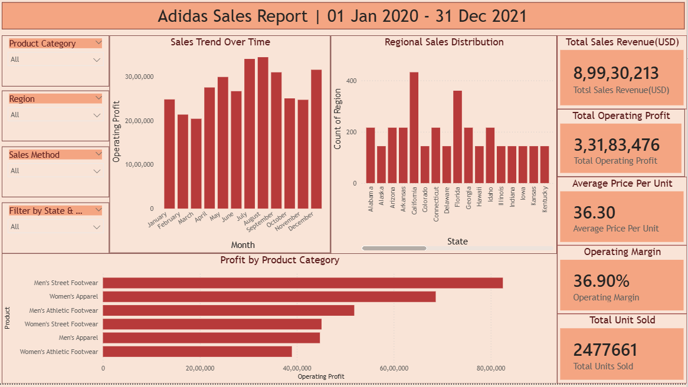
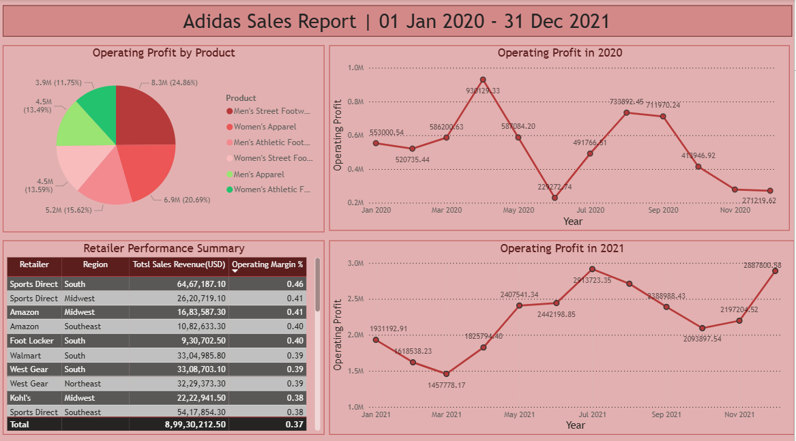

# 📊 Adidas Sales Analysis – Power BI Project

## 👋 Introduction
This is my **first end-to-end Data Analyst project**, built within **2–3 days of starting Power BI**.  
The project focuses on analyzing **Adidas sales performance** and presenting insights using an **interactive Power BI dashboard**.

---

## 🎯 Purpose of the Project
The main goals of this project are:

1. Understand overall sales and profit performance
2. Analyze year-wise growth (2020 vs 2021)
3. Identify top-performing products and regions
4. Practice building business-focused KPIs
5. Learn how to design clean and interactive dashboards

---

## 📂 Step 1: Dataset Understanding
The dataset contains Adidas sales transactions with the following information:
- Order Date
- Region & State
- Product Category
- Units Sold
- Sales Revenue
- Operating Profit
- Operating Margin

📅 **Time Period:** January 2020 – December 2021

---

## 🛠 Step 2: Tool Used
- **Power BI**
  - Data loading and transformation
  - Data modeling
  - DAX measures
  - Interactive visualizations
  - Slicers and filters

---

## 📐 Step 3: KPI Creation
The following key metrics were created to evaluate performance:

- **Total Sales Revenue**
- **Total Operating Profit**
- **Operating Margin (%)**
- **Total Units Sold**
- **Average Price per Unit**

These KPIs help summarize business performance at a glance.

---

## 📊 Step 4: Dashboard – Overview Analysis

This dashboard provides a **high-level view of sales and profit performance**.

### Key elements:
- Total Sales & Profit KPIs
- Monthly sales trend
- Sales by product category
- Sales distribution by region
- Year and region slicers for interactivity

📷 **Dashboard Preview – Overview**

---

## 📈 Step 5: Dashboard – Profit & Product Analysis

This dashboard focuses on **profitability and product-level insights**.

### Key elements:
- Operating profit by product category
- Sales vs profit comparison
- State-wise performance
- Operating margin analysis

📷 **Dashboard Preview – Profit Analysis**

---

## 🔍 Step 6: Insights Derived
From the analysis, the following insights were observed:

- Men’s Street Footwear contributes the highest operating profit
- 2021 shows significant growth compared to 2020
- Certain regions consistently outperform others in revenue
- Profitability varies significantly across product categories

---

## 📁 Project Files
- `End-to-End Adidas Sales Analytics.pbix` – Power BI dashboard file
- `data/sales.xlsx` – Source dataset
- `dashboard_preview/` – Dashboard screenshots used in this README

---

## 🚀 Learning Outcome
Through this project, I learned how to:
- Build an end-to-end Power BI project
- Create meaningful KPIs using DAX
- Design clean and interactive dashboards
- Translate raw data into business insights
- Present analysis in a structured and professional way

---

## 🔜 Next Improvements
Planned enhancements for future versions:
- Tooltips for deeper insights
- Advanced DAX calculations
- SQL-based backend analysis
- Additional time-series comparisons

---

### ⭐ If you’re a recruiter or learner
This project represents my **starting point as a Data Analyst**, and I am actively improving my skills with more advanced projects.

Thank you for viewing this project!
